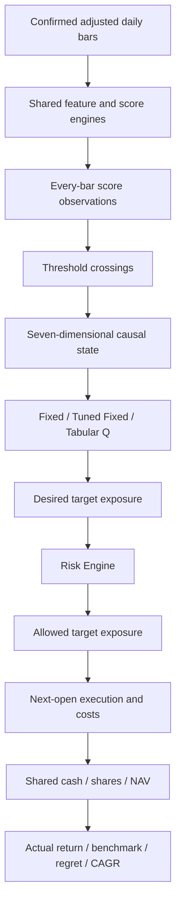

# Strategy G — ACES / 自适应资金效率策略

ACES v1 is an opt-in Auto Tune research generation alongside A–F. It does not
change their feature parameters, recommendation ranking or execution rules.
Enable **Include ACES alongside A–F** to request G; disabling it omits G's work.
The existing allocation study remains available separately. ACES uses the shared
default technical scoring model; it does not claim to inherit validation-tuned F
parameters. This prevents later F selections leaking into earlier ACES folds.

中文：ACES 是独立的 G 代研究策略，默认不启用。A–F 的参数、推荐和执行保持原路径。
G 复用默认评分与资金环境，不把验证选出的 F 参数带回早期训练折。

## Logic and dependency flow / 逻辑与依赖



State dimensions are trigger strength, exposure, cash, unrealized P&L, market
regime, volatility regime and portfolio drawdown. Existing score/exposure/cash/P&L
boundaries are documented in [allocation](auto-tune-allocation.md). Market regime
uses the scoring engine's price-versus-SMA200 and SMA slope convention: both
positive is BULL, both negative BEAR, otherwise SIDEWAYS. This is a stock trend
proxy, not a separately fitted broad-market regime model. ATR/price percentile
uses strictly earlier observations in the configured trailing window. Incomplete
SMA/ATR warmup blocks new exposure. Drawdown buckets use configured boundaries.

Actions remain 0/20/40/60/80/100% exposure plus HOLD. Risk may lower a desired
target, including during a BUY. Portfolio cash and shares enforce no leverage or
overselling. Risk-driven reductions and protective stops bypass ordinary spacing.
Caps are checked at executable opens using prior finalized features. Price drift
can exceed a target between fills; maximum marked exposure is reported honestly.
No intraday continuous cap or guaranteed drawdown ceiling is claimed.

Signal close T executes at regular-session open T+1. Execution delay stress adds
one bar. A new signal supersedes a delayed unfilled order; final unfillable orders
are not moved beyond the segment. Gap checks reuse `execution_policy.evaluate_entry`.
Cash yield compounds idle cash only over calendar days. Zero cash yield is the
explicit default. Dynamic costs use prior ATR/price and prior volume relative to
its average, with coefficients zero by default. Slippage is a component of the
effective one-way cost, never an additional duplicate deduction. Invalid effective
costs fail explicitly instead of being silently capped.

The same risk, cost, cash-yield and protective-exit path evaluates feasible
counterfactual targets. Impossible exposure earns no artificial opportunity
credit. NAV reward, opportunity regret, capped SPY reward and incremental CAGR
deficit remain separate. See [V3 equations](auto-tune-allocation.md#v3-time-value-and-benchmark--时间价值与基准).

中文：七维状态仅含当时信息；市场状态复用均线位置与方向，是个股趋势代理。
波动率百分位只看过去。MDP 目标须经独立风险层，记录期望、允许、实际三个仓位。
风险减仓和止损可绕过普通交易间隔；盘中漂移及跳空仍可能突破目标，不能保证回撤上限。
现金收益仅计闲置现金。真实与反事实共用成本、风险及现金收益规则；奖励不计作利润。

## Search, purge and readiness / 搜索、隔离与就绪

1. Fit Fixed/Tuned Fixed independently for each BUY/SELL pair and each expanding
   validation fold. Features are shared; maps and Q tables are not carried between folds.
2. Train fresh Q policies only in the configured number of promising regions.
   No reward weights, factor weights or Q hyperparameter grid are optimized.
3. Reject candidates violating drawdown, turnover, trade/sample or Q-support rules.
   Profitable validation candidates take precedence over losing ones. Among losing
   candidates, actual median return takes precedence. Reward near-ties prefer the
   simpler policy, broader parameter plateau, more positive folds and less turnover.
4. Stress up to `q_finalists` finalists on validation only, then freeze selection.
   Stress scenarios are base, double cost, double slippage, one-day delay, 1% worse
   entry, 1% worse exit, deterministic signal omissions, four adjacent thresholds,
   and ±20 percentage-point desired allocations. Neighbor thresholds perturb a
   frozen policy for sensitivity; they never continue its Q training.
5. Evaluate the final test once, without selection or learning. No candidate passing
   validation and stress means `selected_policy=null`; displayed rows are diagnostics.

Train endpoints are trimmed by `purge_bars` before each validation fold. In the
Auto Tune integration, the final `purge_bars` development bars are also excluded
from validation, separating it from final test. Each segment starts at NAV=1 and
100% cash, and liquidates at its endpoint. Default 252 bars relates to the longest
default daily lookback; shorter overrides weaken this protection. Small histories
can fail the minimum-data requirement after purging.

Plateau score is the fraction of evaluated adjacent same-policy threshold pairs
that pass risk and remain within the configured absolute-return tolerance.
Unavailable neighbors are unknown, not robust. Every stress fold must pass its
hard checks and remain within tolerance of its base NAV. Readiness PASS requires
a selected robust candidate, positive validation and final-test return, acceptable
test risk/support and complete benchmark data. WARN/FAIL expose failed checks.
These are research acceptance checks; **PASS does not enable live trading**.

中文：先固定映射寻优，再在少数有希望区域独立训练 Q；验证冻结且有隔离期。
硬风险、样本及支持数先筛选，近似持平优先简单策略。压力测试仅用验证集；最终测试
不选参数。没有通过者即不选择，不能用测试表现改选赢家。PASS 仅为研究验收，不开启实盘。

## API, data quality and reproducibility / API 与数据质量

`GET /api/v1/stocks/{ticker}/auto-tune?aces_config=<JSON>` adds optional `aces` to
the response. Existing `strategies` and `recommended` continue to describe A–F.
`aces_config` omitted or `enabled=false` disables G. Invalid settings return 422
before data fetching. ACES data/purge failures return an explicit failed G result,
preserving A–F output. Unknown config/version keys are rejected.

SPY comparison defaults to BLOCK on missing adjusted, exact-date data. DISABLE is
an explicit request override and cannot yield readiness PASS. The API verifies US
stock adjustment basis and does not substitute an unadjusted index. Trailing bars
dated today/future in UTC or explicitly unfinished are excluded from ACES and
recorded as previews. Interior unfinished bars, unordered/duplicate dates or invalid
OHLC/volume fail closed. Missing stock sessions present in the benchmark calendar
also block execution rather than treating a later available bar as the next session.
Historical requested periods are not rejected merely for being old.
This conservative historical cutoff is not a live exchange-calendar scheduler.

Reports store version, config and source hashes, git HEAD/dirty status, input hash,
provider/adjustment metadata, cached feature parameters, thresholds, fitted target
maps, Q entries/support, fold dates, costs and benchmark assumptions. Preserve the
input snapshot and matching source for reproducibility; git HEAD alone is insufficient
when the workspace is dirty. Thresholds may differ for a diagnostic Q comparison;
each row records its own pair. Training/validation summary rows use the latest fold;
all validation folds remain in candidate records.

Benchmark curves start at 1 using gross adjusted close ratios for SPY/stock and a
configured cash-growth index. Actual strategy NAV includes costs. Stock Buy & Hold
financial metrics use the same first-close origin and include entry/exit costs.
Return capture is undefined when passive return is nonpositive; drawdown reduction
and Sharpe difference remain separate. Initial budget scales financial amounts;
normalized policy fitting always starts at NAV=1.

中文：请求级 JSON 启用 G，旧字段兼容。基准默认严格要求同日复权 SPY。当天未完成尾部
日线排除并记录，异常历史数据明确失败。保存输入与源码版本才能复现；脏工作区仅有提交号
不足以复现。图中基准是归一化复权总收益，资金指标扣费；初始预算只缩放实际金额。

## Configuration / 配置

Defaults below are generated from `ACESConfig().to_dict()`. Basic UI controls
override advanced JSON fields. Presets populate exposure/drawdown only:
Conservative 60%/10%, Balanced 100%/15%, Aggressive 100%/25%; names do not alter results.
API omitted drawdown uses the existing portfolio drawdown alert setting (15% by
default). The multi-stock 35% concentration alert is not transplanted into this
single-stock research account. Sector limits await actual portfolio mode.

Ranges: normalized rates [0,1]; initial budget (0,1e12]; 1–7 distinct integer BUY
thresholds [1,30] and SELL [-30,-1]; purge [1,1260]; Q finalist count [1,5]; volatility
lookback [20,1260]; minimum trades [1,1000]; validation samples [10,1000]; turnover
(0,1000]; spacing [1,365]; optional ATR multiples (0,20]; delay [0,5]; skip cadence
[0,100]. Volatility percentiles and drawdown edges must increase; volatility caps
must not increase. Q rates and remaining reward boundaries follow the allocation
documentation; ACES requires minimum visits ≥1. Slippage cannot exceed total cost.
Percent-suffixed cost inputs are percent units, unlike fraction-valued reward/risk.

中文：基础控件优先于高级 JSON。预设仅填充仓位/回撤；所有默认值如下。多股集中度告警
不直接用于单股账户。数值范围与服务端模型同步，比例和百分数成本单位必须区分。

```json
{
  "version": 1,
  "enabled": true,
  "initial_budget": 10000.0,
  "buy_thresholds": [
    4,
    5,
    6,
    7,
    8
  ],
  "sell_thresholds": [
    -4,
    -5,
    -6,
    -7,
    -8
  ],
  "policy_mode": "COMPARE",
  "purge_bars": 252,
  "q_finalists": 3,
  "minimum_plateau_fraction": 0.5,
  "stress_return_tolerance": 0.05,
  "allocation": {
    "policy_mode": "AUTO",
    "simplicity_tolerance": 0.01,
    "q": {
      "alpha": 0.1,
      "gamma": 0.95,
      "epsilon_start": 0.3,
      "epsilon_end": 0.02,
      "epsilon_decay": 0.99,
      "episodes": 100,
      "random_seed": 42,
      "minimum_visit_count": 10
    },
    "state": {
      "medium_score": 4.0,
      "strong_score": 7.0,
      "pnl_edges": [
        -0.15,
        -0.05,
        0.05,
        0.15
      ],
      "use_regime": true
    },
    "lambda_opportunity": 0.25,
    "opportunity_band": 2.0,
    "threshold_iterations": 2,
    "validation_folds": 3,
    "economic": {
      "target_cagr": 0.3,
      "lambda_cagr": 0.25,
      "lambda_alpha": 1.0,
      "lambda_underperform": 0.5,
      "alpha_reward_cap": 0.05,
      "alpha_penalty_cap": 0.05,
      "alpha_margin": 0.0,
      "minimum_cagr_days": 90,
      "allowed_max_drawdown": 0.15,
      "benchmark_missing_policy": "BLOCK"
    }
  },
  "risk": {
    "maximum_exposure": 1.0,
    "volatility_control": true,
    "volatility_caps": [
      1.0,
      1.0,
      0.6,
      0.2
    ],
    "volatility_percentiles": [
      0.25,
      0.75,
      0.95
    ],
    "volatility_lookback": 252,
    "drawdown_edges": [
      0.05,
      0.1,
      0.2,
      0.3
    ],
    "maximum_turnover": 20.0,
    "minimum_trades": 2,
    "minimum_validation_samples": 40,
    "maximum_fallback_fraction": 0.8
  },
  "execution": {
    "cost_pct_per_side": 0.1,
    "slippage_pct": 0.02,
    "volatility_slippage_factor": 0.0,
    "liquidity_slippage_factor": 0.0,
    "cash_yield": 0.0,
    "min_trade_gap_bars": 5,
    "buy_spacing_bars": 20,
    "max_entry_gap_atr": 1.0,
    "stop_multiple_atr": 3.0,
    "trail_multiple_atr": 4.0,
    "delay_bars": 0,
    "entry_worsening": 0.0,
    "exit_worsening": 0.0,
    "skip_every": 0
  }
}
```

## Current limitations and rollback / 边界与回滚

This delivers the research P0/P1 engine and a basic P2 setup/results surface.
Advanced parameters and detailed stress/fold evidence currently use expandable
JSON rather than a dedicated control/tooltip for every field. Progress is the
existing aggregate Auto Tune estimate, not streamed server stages. Jobs remain
synchronous (ACES Web timeout 15 minutes); cancellation/resume and a job queue are
not implemented. ACES Fine Tune window search is not integrated. Basic history/test
controls are inherited from Auto Tune rather than an independent date-range editor.

No paper/live execution adapter, broker reconciliation, live data-staleness monitor,
drift monitor, bootstrap confidence, multi-stock/sector constraints, tax-lot model
or separate measured risk-free yield feed is installed. `live_enabled=false` is
explicit. The seven-dimensional state omits cooldown/protection history and is a
coarse Markov approximation. More complexity is not evidence of outperformance.

Disable ACES to stop G computation while retaining A–F and prior allocation work.
Code rollback must remove the G API/Web additions and the optional runtime hooks
together, preserving V1–V3 work; rebuild Web. No migration or automatic deployment.
Screenshots and one-time implementation/historical reports belong outside Git.

中文：本次完成研究 P0/P1 和基础 P2 界面；逐字段高级控件、真实分阶段进度、后台任务、
Fine Tune 接入、实盘/纸面适配及漂移监控尚未完成。始终禁止实盘安装。关闭 G 不影响
A–F；回滚需同步可选运行适配器、API 和 Web，不撤销已有 V1–V3 工作，无数据库迁移。
中英文已同步；临时验收材料不入库。
